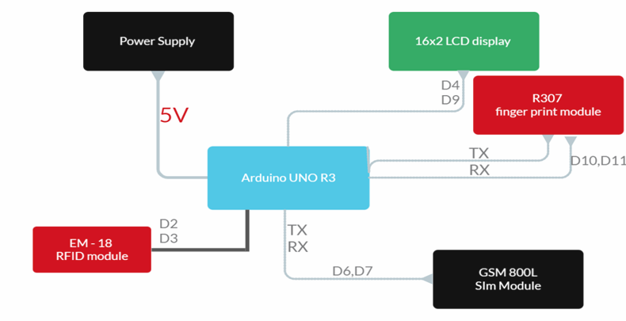
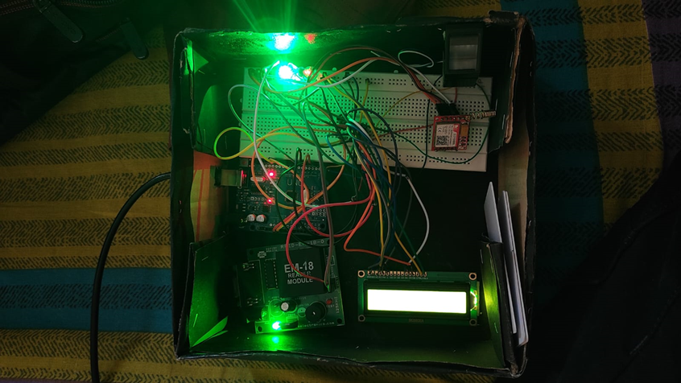

# Arduino-attendace-system
Student attendance system using Arduino and C language inclus=ding gsm and fingerprint modules 
This project outlines building a secure access system using an Arduino Uno, GSM module, fingerprint sensor, SMS verification, and RFID reader. 

 Components:

Arduino Uno
GSM Shield (compatible with your network provider)
Fingerprint Sensor Module (e.g., R305)
RFID Reader Module (e.g., MFRC522)
Power supply (e.g., 5V, 2A)
LEDs (2 colors)
Buzzer
Connecting wires
Breadboard (optional)

  Components:

Arduino Uno
GSM Shield (compatible with your network provider)
Fingerprint Sensor Module (e.g., R305)
RFID Reader Module (e.g., MFRC522)
Power supply (e.g., 5V, 2A)
LEDs (2 colors)
Buzzer
Connecting wires
Breadboard (optional)

Software

Arduino IDE
GSM library (e.g., TinyGSM)
Fingerprint library (e.g., Adafruit Fingerprint)
RFID library (e.g., MFRC522)
